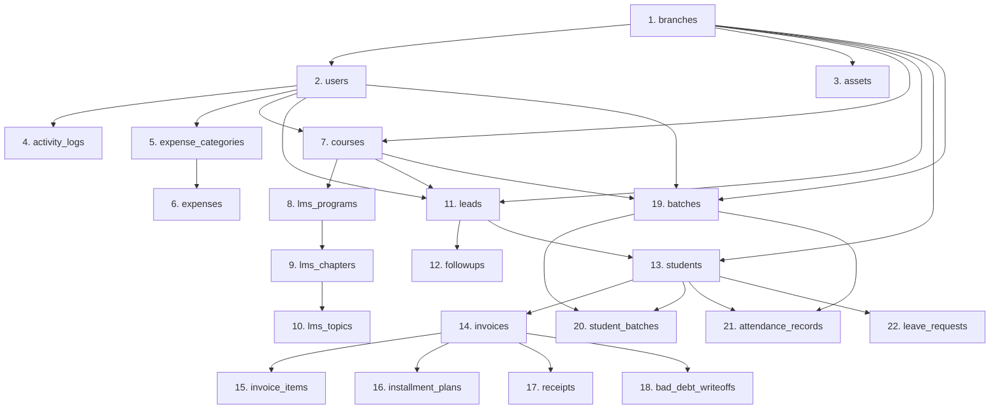

# Database Migration Plan (SQLite to MySQL)

This document outlines the strategy for migrating the production database from SQLite (`instance/database.db`) to MySQL, detailing data type transformations, loading sequences, verification steps, and database recovery strategies.

---

## 1. Data Type Conversion Mapping

SQLite utilizes dynamic typing with affinity classes. MySQL enforces strict column types. During the migration, the data types must be mapped and transformed:

| SQLite Source Type | Target MySQL Type | Mapping & Transformation Strategy | Rationale |
| :--- | :--- | :--- | :--- |
| `INTEGER PRIMARY KEY AUTOINCREMENT` | `INT NOT NULL AUTO_INCREMENT` | Map directly. MySQL will assign native auto-increment keys. | Native key handling in MySQL. |
| `TEXT` (Demographics, Titles) | `VARCHAR(255)` or `VARCHAR(100)` | Map to MySQL `VARCHAR` with appropriate character limits. | Prevents disk space wastage and improves lookup indexing performance. |
| `TEXT` (Paragraphs, logs, notes) | `TEXT` or `LONGTEXT` | Map to standard MySQL `TEXT`. | Accommodates variable length notes and JSON records. |
| `TEXT` (ISO Date/Time Strings) | `DATETIME` or `DATE` | Parse `TEXT` string using `datetime.strptime()` or `dateutil.parser`. Convert to UTC timezone-aware objects before writing. | Enables indexing, native interval queries, and resolves timezone inconsistencies. |
| `REAL` (Financial columns, fees, amounts) | `DECIMAL(12, 2)` | Convert SQLite float representations to Python `decimal.Decimal` objects with two decimal places. | **Critical for financial accuracy**. Floating-point types (`REAL` / `DOUBLE`) introduce rounding errors during aggregations. |
| `INTEGER` (Booleans, status flags) | `TINYINT(1)` or `BOOLEAN` | Convert integers (`0` / `1`) to MySQL binary boolean values. | Maps cleanly to Django's standard `BooleanField`. |

---

## 2. Structural Schema Transformations (SQLite vs MySQL)

1. **Foreign Key Constraints**: SQLite constraints are often disabled by default (`PRAGMA foreign_keys = OFF`). MySQL strictly enforces key validity on inserts. Migration scripts must ensure all foreign key references exist in parent tables.
2. **CHECK Constraints**: SQLite checks like `CHECK(role IN ('admin', 'staff'))` will be replaced by Django model `choices` definitions, which handles validation at the application tier.
3. **Empty Strings vs NULL**: SQLite queries often mix empty strings (`""`) and `NULL` values. The ETL script must clean up columns where `NULL` is expected (e.g. `email`, `whatsapp`, `parent_contact`) to avoid violating unique constraints in MySQL.

---

## 3. Recommended Migration Sequence (Topological Order)

To satisfy foreign key checks, tables must be loaded in the following order:



---

## 4. ETL Script Strategy

The data migration will run via a custom Django management command rather than using manual export/import tools. This command utilizes Django's ORM database router to extract from SQLite and bulk-insert into MySQL.

### Architectural Steps of the ETL Command:
1. **Prepare Target Database**: Initialize the MySQL database and run Django migrations:
   ```bash
   python manage.py migrate --database=default
   ```
2. **Establish Dual Connections**: Configure the SQLite file as a read-only secondary database in Django settings under `DATABASES['sqlite_source']`.
3. **Execute ETL Batches**: Read from the SQLite database sequentially using iterator queries, transform row-by-row in Python, and bulk-save to MySQL.
4. **Transaction Protection**: Wrap each table bulk load inside `transaction.atomic()` to guarantee that if a table import fails, it rolls back completely, preventing half-populated states.

### Transform Code Example (Conceptual):
```python
# Conceptual python snippet for the migration controller
from django.db import transaction
from django.utils.dateparse import parse_datetime
from decimal import Decimal
import pytz

def migrate_invoices():
    # Fetch from SQLite using direct cursor or secondary DB connection
    sqlite_invoices = SQLiteInvoice.objects.all()
    
    mysql_invoices = []
    for invoice in sqlite_invoices:
        # Transformation checks
        date_obj = parse_datetime(invoice.invoice_date)
        if date_obj and not date_obj.tzinfo:
            date_obj = pytz.timezone("Asia/Kolkata").localize(date_obj)
            
        mysql_invoices.append(
            Invoice(
                id=invoice.id,
                invoice_no=invoice.invoice_no,
                student_id=invoice.student_id,
                invoice_date=date_obj,
                subtotal=Decimal(str(invoice.subtotal)),
                discount_amount=Decimal(str(invoice.discount_amount)),
                total_amount=Decimal(str(invoice.total_amount)),
                status=invoice.status.lower(),  # Standardize casing
                created_by_id=invoice.created_by,
                branch_id=invoice.branch_id,
                sms_token=invoice.sms_token,
            )
        )
        
    # Bulk write to MySQL
    with transaction.atomic(using='default'):
        Invoice.objects.bulk_create(mysql_invoices, batch_size=500)
```

---

## 5. Data Validation & Integrity Process

To ensure no data corruption occurs during migration, we will execute a three-tier validation check:

1. **Row Count Matches**:
   Verify that the total row count in MySQL matches the row count in SQLite for every single table.
2. **Aggregated Financial Checksums**:
   Run sum queries on transaction amounts. For example, the total of all receipts in SQLite must equal the total in MySQL:
   $$\sum \text{SQLite receipts.amount\_received} = \sum \text{MySQL receipts.amount\_received}$$
3. **Foreign Key Integrity Validation**:
   Check for orphaned child records (referential integrity check):
   ```sql
   SELECT COUNT(*) FROM invoices WHERE student_id NOT IN (SELECT id FROM students);
   ```

---

## 6. Rollback Strategy

If anomalies occur during the production cutover, the rollback protocol guarantees zero downtime:

1. **Keep SQLite Read-Only**: During the migration process, put the Flask application in a read-only maintenance mode (redirecting users to a maintenance page) while database synchronization is in progress.
2. **Backup Production SQLite**: Create a physical copy of `instance/database.db` and copy it to a secure backup directory.
3. **Validation Cutoff**: If validation tests fail or critical application errors occur post-migration, stop the MySQL instance, restart the Flask app servers pointing back to the read-only SQLite database file, and reopen traffic.
4. **Post-Live Switchover**: Keep the SQLite copy intact for 48 hours after launching MySQL.
