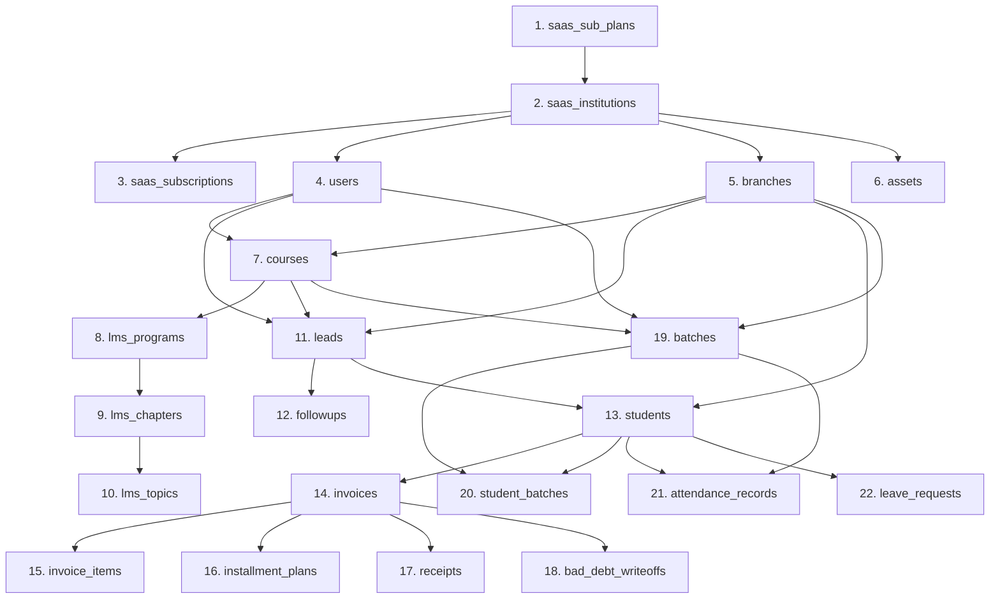

# Database Migration Plan V2: SQLite to Multi-Tenant MySQL

This document defines the schema transformation, data load sequencing, and ETL script execution patterns required to migrate the single-tenant SQLite database (`instance/database.db`) into the multi-tenant SaaS MySQL database schema.

---

## 1. Schema Partitioning (Adding Tenant Columns)

In the target MySQL database, every tenant-scoped table is updated to include an `institution_id` column as a Foreign Key referencing the core `saas_institutions` table.

```text
Single Tenant SQLite:
[branches] (id, branch_name, branch_code, ...)

Multi-Tenant MySQL:
[saas_institutions] (id, name, subdomain, ...)
[branches] (id, institution_id [FK], branch_name, branch_code, ...)
```

All query constraints must validate this column to prevent cross-tenant exposure.

---

## 2. Multi-Tenant Topological Load Sequence

To support foreign key integrity constraints, the migration order begins by defining the global subscription plans and initializing the initial tenant (`Global IT Education`):



---

## 3. ETL Migration Script Strategy

The data migration is executed via a Django custom management command:
`python manage.py migrate_sqlite_to_mysql --sqlite-path=instance/database.db --tenant-name="Global IT Education" --subdomain="global-it"`

### Steps Executed by the ETL Command:
1. **Initialize Staging Tenant**: Creates the default target `Institution` (e.g. `Global IT Education`, subdomain: `global-it`) and binds a default active `Subscription` record.
2. **Read SQLite Source**: Connects to the SQLite file as a secondary database.
3. **Map and Transform Records**:
   * Reads SQLite records sequentially.
   * Maps each record's primary keys to MySQL, automatically injecting the newly created `institution_id` (foreign key) into all models that inherit from `TenantModel`.
   * Normalizes values: parses string ISO dates to UTC datetime objects, and converts SQLite floats to `Decimal` objects (preventing roundoff errors in billing collections).
4. **Enforce Transaction Boundaries**: Wraps table imports in a `transaction.atomic()` context. If any row in a table fails data type constraints, the entire table is rolled back, preventing half-migrated states.

### conceptual Python Script Snippet:
```python
# apps/tenants/management/commands/migrate_sqlite_to_mysql.py
from django.core.management.base import BaseCommand
from django.db import transaction
from tenants.models import Institution, Subscription
from core.models import User, Branch
from finance.models import Invoice
from decimal import Decimal
import pytz
from django.utils.dateparse import parse_datetime

class Command(BaseCommand):
    help = "Migrate single-tenant SQLite database to multi-tenant MySQL"

    def handle(self, *args, **options):
        # 1. Create target tenant
        with transaction.atomic():
            tenant, _ = Institution.objects.get_or_create(
                name=options.get('tenant-name', 'Global IT Education'),
                subdomain=options.get('subdomain', 'global-it'),
                status='active'
            )
            self.stdout.write(f"Tenant initialized with ID: {tenant.id}")
            
            # 2. Migrate branches
            sqlite_branches = SQLiteBranch.objects.using('sqlite_source').all()
            mysql_branches = []
            for b in sqlite_branches:
                mysql_branches.append(
                    Branch(
                        id=b.id,
                        institution=tenant,  # Inject tenant foreign key
                        branch_name=b.branch_name,
                        branch_code=b.branch_code,
                        is_active=b.is_active
                    )
                )
            Branch.objects.bulk_create(mysql_branches)
            self.stdout.write("Branches migrated successfully.")
            
            # 3. Migrate Invoices
            sqlite_invoices = SQLiteInvoice.objects.using('sqlite_source').all()
            mysql_invoices = []
            for inv in sqlite_invoices:
                date_parsed = parse_datetime(inv.invoice_date)
                if date_parsed and not date_parsed.tzinfo:
                    date_parsed = pytz.timezone("Asia/Kolkata").localize(date_parsed)
                
                mysql_invoices.append(
                    Invoice(
                        id=inv.id,
                        institution=tenant,  # Inject tenant foreign key
                        invoice_no=inv.invoice_no,
                        student_id=inv.student_id,
                        invoice_date=date_parsed,
                        total_amount=Decimal(str(inv.total_amount)),
                        status=inv.status.lower()
                    )
                )
            Invoice.objects.bulk_create(mysql_invoices)
            self.stdout.write("Invoices migrated successfully.")
```

---

## 4. Multi-Tenant Validation & Integrity Auditing

To verify that the ETL script has accurately preserved data boundaries, we run three integrity checks post-migration:

1. **Row Count Audit**: Compare matching counts across SQLite tables and MySQL collections filtered by the target `institution_id`.
2. **Financial Verification Checksum**: Run sum aggregations on transaction collections:
   $$\sum \text{SQLite receipts.amount\_received} = \sum \text{MySQL receipts.amount\_received (WHERE institution\_id = tenant\_id)}$$
3. **Data Isolation Sanity Check**: Verify that no database record exists in MySQL where the `institution_id` is empty (`NULL`), and that no model is pointing to an invalid `institution_id`.
   ```sql
   SELECT COUNT(*) FROM invoices WHERE institution_id IS NULL;
   SELECT COUNT(*) FROM students WHERE institution_id NOT IN (SELECT id FROM saas_institutions);
   ```

---

## 5. Rollback Strategy
1. **Maintenance Redirect**: Put the Flask application in maintenance mode, redirecting all incoming HTTP requests to a static notice screen.
2. **Physical Data Snapshots**: Physical backup copy of SQLite database file is kept safe.
3. **Staging Validation Dry-Run**: Run the ETL commands and verify the target data set on a separate staging schema first.
4. **Anomalous Cutoff**: If database validation checks fail during production migration, terminate the target server container nodes and route DNS traffic back to the Flask + SQLite system.
