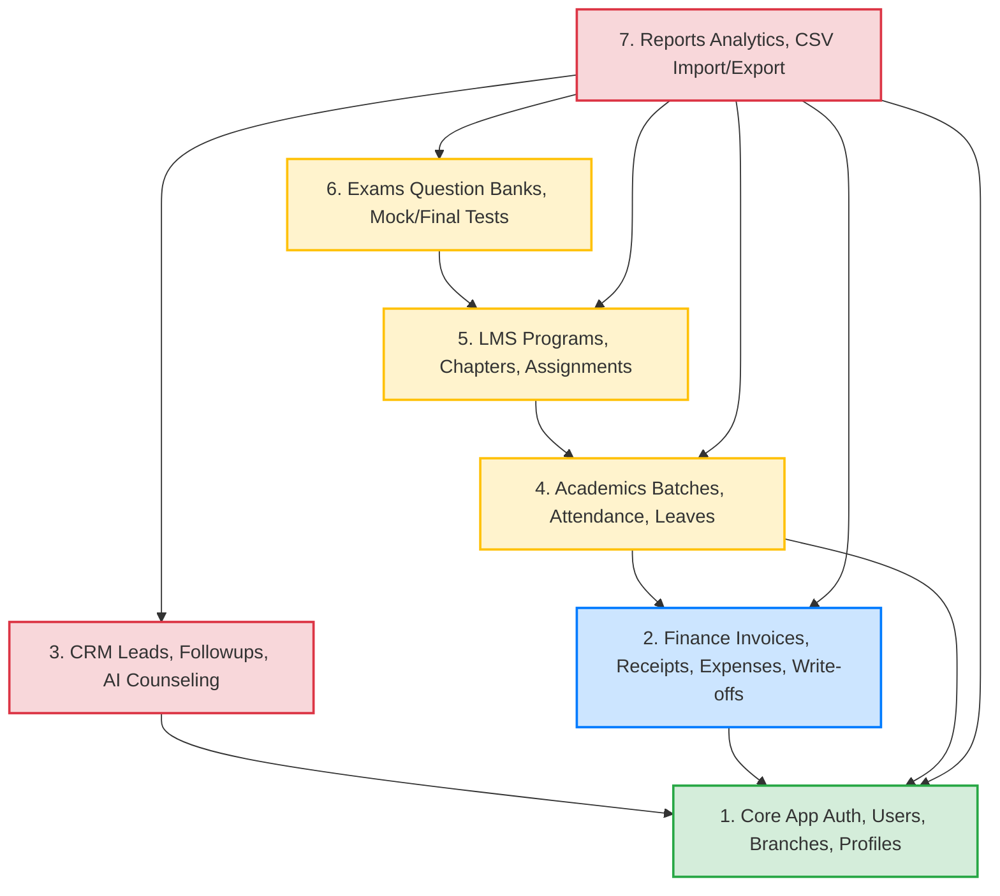

# Module Dependency Map

This document maps the inter-module dependencies of the Global IT Education ERP system and outlines the mathematically correct topological sort order for rebuilding and migrating these modules.

---

## 1. System Module Dependency Graph

The dependencies between the ERP modules are structured hierarchically, starting from the core infrastructure up to the specialized academic testing layers.

---

## 2. Detailed Module Dependencies & Interfaces

### A. Core Module (Authentication, Users, Branches, Profiles)
* **Status**: Core foundation.
* **Dependencies**: None.
* **Interfaces Provided**:
  * Provides `User` and `Branch` models to all other apps.
  * Encapsulates `ActivityLog` schema for system-wide auditing.
  * Exposes global branding variables from `CompanyProfile`.

### B. Finance Module (Billing & Expenses)
* **Status**: Critical business layer.
* **Dependencies**:
  * `Core`: Requires `User` for tracking who created invoices/receipts/expenses, `Branch` for financial localization, and `Student` records for billing.
* **Interfaces Provided**:
  * Exposes the `Course` registry model (which defines tuition costs) to CRM (for tracking interest fields) and Academics (for mapping teaching batches).
  * Exposes invoice and payment status APIs to the student portal views.

### C. CRM Module (Leads)
* **Status**: Enrollment pipeline.
* **Dependencies**:
  * `Core`: Requires `User` to assign lead owners (counselors) and `Branch` for tracking local lead distributions.
  * `Finance`: Requires `Course` to specify interested courses in prospect profiles.
* **Interfaces Provided**:
  * Exposes a `lead_id` attribute to `Student` profiles, completing the lifecycle from lead to active enrollment.

### D. Academics Module (Batches, Attendance, Leaves)
* **Status**: Daily operations engine.
* **Dependencies**:
  * `Core`: Requires `Student` records to form batches, `User` for assigns trainers, and `Branch` for classroom allocation.
  * `Finance`: Requires `Course` to assign a course syllabus schema to a cohort batch.
* **Interfaces Provided**:
  * Exposes `Batch` and `StudentBatch` records to the LMS module to dictate student access privileges to courses.

### E. LMS Module (Learning Management)
* **Status**: Content and student portal engine.
* **Dependencies**:
  * `Core` & `Academics`: Requires student records and `Batch` mappings to query course program access lists.
  * `Finance`: Requires `Course` mappings to automatically link course codes with LMS digital programs.
* **Interfaces Provided**:
  * Exposes `MasterTopic` progress nodes to the Exams module to verify final exam applicant eligibility.

### F. Exams Module (Mock & Final Exams)
* **Status**: Certification layer.
* **Dependencies**:
  * `LMS`: Mock tests require randomized draws from MCQ question banks mapped to specific LMS `MasterChapters` and `MasterTopics`. Final exam eligibility checks depend on student syllabus completion metrics from the LMS progress tables.

### G. Reports Module (Analytics & CSVs)
* **Status**: Management reporting.
* **Dependencies**:
  * All modules. Reports sit on top of the entire database schema, running aggregations across Leads, Invoices, Attendance, and Exams.

---

## 3. Safest Migration and Build Order (Topological Sort)

Rebuilding the system in an arbitrary order will lead to broken foreign key migrations, model import loops, and incomplete data pipelines. The migration and development process must follow this strict topological sort:

1. **Step 1: `core` App Development**
   * *Deliverables*: Database setup, User model migrations, branches, login templates, SMS client helper.
2. **Step 2: `finance` App Development**
   * *Deliverables*: Course registry, Invoices, Installment Plans, Receipts, and Expenses.
3. **Step 3: `crm` App Development**
   * *Deliverables*: CRM Leads board, follow-up timelines, AI counseling assistants, lead stage mutations.
4. **Step 4: `academics` App Development**
   * *Deliverables*: Teaching Batches, Attendance roll calls, leave applications, defaulter followups.
5. **Step 5: `lms` App Development**
   * *Deliverables*: Master Program setup, Chapter structures, topic slides, assignment file uploads.
6. **Step 6: `exams` App Development**
   * *Deliverables*: MCQ pool management, mock quizzes, final exam applications, certificate grading.
7. **Step 7: `reports` App Development**
   * *Deliverables*: Transaction dashboard, counselor metrics, bulk CSV backups and restore utilities.
