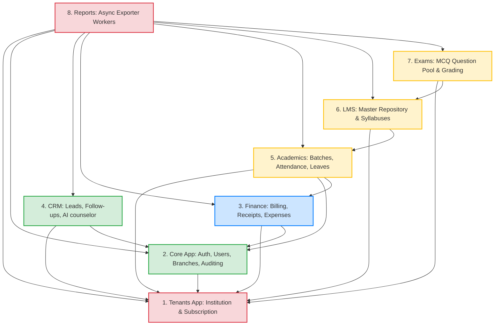

# Module Dependency Map V2

This document maps the inter-module dependencies of the SaaS Education Management Platform and outlines the topological build order for code migration.

---

## 1. System Module Dependency Graph

In the multi-tenant architecture, the `tenants` module acts as the base dependency layer. No tenant-isolated module can load or write records without referencing the active `Institution` state:

---

## 2. Detailed Module Dependencies & SaaS Interfaces

### A. Tenants Module (Institution, Subscription)
* **Status**: Core SaaS foundation.
* **Dependencies**: None.
* **Interfaces Provided**:
  * Exposes the `Institution` model to hook into all models inheriting from `TenantModel`.
  * Exposes custom middleware (`TenantResolutionMiddleware`) that injects the active tenant object into the thread-local state and requests.
  * Checks subscription plans and limits (e.g. max branches) before permitting CRUD writes in child modules.

### B. Core Module (Authentication, Users, Branches, Profiles)
* **Status**: Base user management framework.
* **Dependencies**:
  * `Tenants`: Requires `Institution` to scope user credentials and branch locations.
* **Interfaces Provided**:
  * Exposes custom `User` containing role categories, and `Branch` models to crm, finance, academics, and LMS.

### C. Finance Module (Billing & Expenses)
* **Status**: Accounting & transactions.
* **Dependencies**:
  * `Core`: Requires `User` for action attribution and `Student` records for invoicing.
  * `Tenants`: Requires `Institution` to separate the financial ledger (receipt numbers, custom invoice prefixes).

### D. CRM Module (Leads)
* **Status**: Enrollment pipeline.
* **Dependencies**:
  * `Core` & `Tenants`: Scopes counseling assignments by branch and counselor role under the active tenant.

### E. Academics Module (Batches, Attendance, Leaves)
* **Status**: Academic operations.
* **Dependencies**:
  * `Core`, `Tenants`, & `Finance`: Maps trainer schedules and batches to active courses and student records.

---

## 3. Safest Build and Migration Order (Topological Sort)

To prevent code integration loops and circular migration check failures, develop modules in the following order:

1. **Step 1: `tenants` App Development**
   * Setup `Institution`, `SubscriptionPlan`, `Subscription`, `SubscriptionLimit`. Build the `TenantResolutionMiddleware` and thread-local selectors.
2. **Step 2: `core` App Development**
   * Build the abstract `TenantModel`, the custom user authentication (`AbstractUser`), and database logs scoped to the active tenant.
3. **Step 3: `finance` App Development**
   * Build course catalogs, invoicing modules, receipts distribution engines, and expenses tracking.
4. **Step 4: `crm` App Development**
   * Build CRM prospect pipelines and AI-guided counseling assistants.
5. **Step 5: `academics` App Development**
   * Build batch planning templates, daily roll-call interfaces, and student leaves processing.
6. **Step 6: `lms` App Development**
   * Link master chapters to student portals, with customizable visibility configurations per tenant.
7. **Step 7: `exams` App Development**
   * Setup MCQ banks and Mock/Final quiz grading engines.
8. **Step 8: `reports` App Development**
   * Setup background task queues (Celery) to compile and export tenant backup directories.
9. **Step 9: SaaS Operations & Dashboards**
   * Setup platform owner configurations (creating/suspending institutions, analyzing global analytics).
