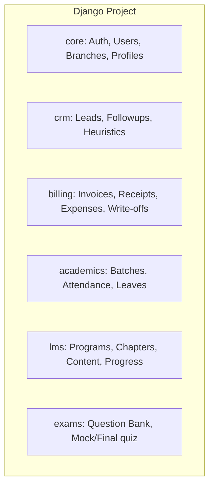

# Project Analysis: Flask Attendance & Billing ERP

This document provides a comprehensive technical analysis of the existing Flask codebase and its SQLite database schema, outlining the system's architecture, business logic, constraints, validations, and a migration roadmap to Django.

---

## 1. Folder Structure

The project is structured as a modular Flask application using Flask Blueprints. It separates front-end templates, static assets, database interfaces, and scripts.

```text
attnandbilling/
├── app.py                      # Flask app factory, blueprint registrations, and custom Jinja filters
├── config.py                   # App configuration (session times, database URI, file limits, external APIs)
├── db.py                       # SQLite database connection factory, migrations, activity logging, and schema bootstrap
├── extensions.py               # Instantiation of Flask-WTF CSRFProtect and Flask-Limiter
├── requirements.txt            # Python dependencies
├── modules/                    # Application backend modules grouped by domain
│   ├── assets/                 # Asset inventory management
│   │   ├── __init__.py
│   │   └── routes.py
│   ├── attendance/             # Batch creation, attendance, leave requests, and defaulters
│   │   ├── __init__.py
│   │   └── routes.py
│   ├── baddebt/                # Bad debt write-offs workflows
│   │   ├── __init__.py
│   │   └── routes.py
│   ├── billing/                # Student admission, invoicing, receipts, and expenses
│   │   ├── __init__.py
│   │   ├── auto_reminders.py   # Fee reminder cron/script logic
│   │   └── routes.py
│   ├── core/                   # ERP auth, home dashboards, user/branch management, SMS gateway
│   │   ├── __init__.py
│   │   ├── routes.py
│   │   ├── sms.py              # Cloud API integration for sending messages
│   │   └── utils.py            # Authorization decorators (login_required, admin_required)
│   ├── exams/                  # MCQ bank, Mock exams, and final exam systems
│   │   ├── __init__.py
│   │   └── routes.py
│   ├── expenses/               # Module placeholder for expense categories
│   │   └── __init__.py
│   ├── import_export/          # Global data backup and tables export
│   │   ├── __init__.py
│   │   └── routes.py
│   ├── leads/                  # CRM module for prospect tracking and AI counseling follow-ups
│   │   ├── ai_helper.py        # Gemini API messaging and counseling suggestions
│   │   ├── helpers.py          # CRM display utilities
│   │   ├── routes.py
│   │   └── services.py         # Lead scoring, temperature calculations, and stage workflows
│   ├── lms_admin/              # LMS program builders, topic contents, and assignment reviews
│   │   ├── __init__.py
│   │   ├── branch_helpers.py
│   │   └── routes.py
│   ├── reports/                # Analytics and imports (counselor stats, CSV uploads/downloads)
│   │   ├── __init__.py
│   │   └── routes.py
│   ├── students/               # Student portal routes (dashboard, topic views, mock exams, assignments)
│   │   ├── __init__.py
│   │   └── routes.py
│   └── website/                # Public marketing website and query form capture
│       ├── __init__.py
│       └── routes.py
├── static/                     # Static files (CSS, JS, images, uploaded assets)
│   ├── css/
│   │   ├── bootstrap.min.css
│   │   ├── flatpickr.min.css
│   │   └── style.css           # Custom styles
│   ├── images/
│   │   ├── company_logo/       # Logo uploaded by administrators
│   │   ├── student_photos/     # Student ID card photos
│   │   └── student_signatures/ # Student/parent signature files
│   ├── js/
│   │   ├── bootstrap.bundle.min.js
│   │   ├── flatpickr.min.js
│   │   ├── html2pdf.bundle.min.js
│   │   └── pdfjs/              # PDF JS viewer libraries
│   └── lms/                    # LMS uploaded files (videos, pdfs, images, downloads)
├── templates/                  # Server-rendered HTML templates grouped by module
│   ├── base.html               # Main ERP shell Layout
│   ├── login_base.html         # Login layout wrapper
│   ├── print_base.html         # Printed invoice/receipt layout wrapper
│   ├── includes/               # Reusable sidebars, mobile headers, and floating action menus
│   ├── core/, leads/, billing/, attendance/, baddebt/, assets/, LMS_admin/, students/, website/
└── scripts/                    # Backfill and data maintenance scripts (e.g. fee reminder crons, pilots migrations)
```

---

## 2. Complete Route Registry

Below is a categorized table mapping registered Flask routes, endpoints, methods, and their blueprint ownership.

| Route Rule | Blueprint/Endpoint | Methods | Description |
|---|---|---|---|
| **Public Website / General** | | | |
| `/` | `website.home` | `GET` | Home landing page showing course catalog |
| `/enquire` | `website.enquire` | `POST` | Public query form submission to Leads |
| `/courses/<slug>` | `website.course_page` | `GET` | Renders dynamic HTML detail pages for courses |
| `/uploads/content/<path:filename>` | `serve_content` | `GET` | Serves uploaded LMS files |
| `/uploads/leave_docs/<path:filename>` | `serve_leave_doc` | `GET` | Serves student leave documentation (requires auth) |
| **Authentication & Core Administration** | | | |
| `/erp` | `core.home` | `GET` | ERP Entry point redirecting to login/dashboard |
| `/login` | `core.login` | `GET, POST` | ERP staff/admin authentication |
| `/logout` | `core.logout` | `GET` | Logs out user, invalidates session cookie |
| `/dashboard` | `core.dashboard` | `GET` | Renders Admin dashboard or trainer dashboard based on role |
| `/api/sidebar-badges` | `core.sidebar_badges` | `GET` | JSON endpoint returning counts for due items |
| `/users` | `core.users` | `GET` | Lists all ERP users (admin only) |
| `/users/new` | `core.user_new` | `GET, POST` | Creates a new staff/admin user (admin only) |
| `/users/<int:user_id>/edit` | `core.user_edit` | `GET, POST` | Edits an existing user (admin only) |
| `/users/<int:user_id>/toggle-status` | `core.user_toggle_status` | `POST` | Activates/deactivates a user account |
| `/branches` | `core.branches` | `GET` | Lists branches (admin only) |
| `/branches/new` | `core.branch_new` | `GET, POST` | Creates a new branch (admin only) |
| `/branches/<int:branch_id>/edit` | `core.branch_edit` | `GET, POST` | Edits a branch (admin only) |
| `/branches/<int:branch_id>/toggle-status` | `core.branch_toggle_status` | `POST` | Toggles branch active status |
| `/company-profile` | `core.company_profile` | `GET, POST` | Settings for logo and branding (admin only) |
| `/company-profile/remove-logo` | `core.company_profile_remove_logo`| `POST` | Deletes the company profile logo |
| `/admin/sms/send` | `core.sms_send` | `POST` | Internal JSON API to send custom SMS alerts |
| `/admin/sms/test` | `core.sms_test` | `GET` | Sends a test message to validation phone |
| **CRM (Leads)** | | | |
| `/leads/` | `leads.dashboard` | `GET` | CRM dashboard with conversion metrics & followups |
| `/leads/new` | `leads.lead_create` | `GET, POST` | Manually creates a prospect lead |
| `/leads/<int:lead_id>` | `leads.lead_detail` | `GET` | Detailed view of lead profile & followup history |
| `/leads/list` | `leads.leads_list` | `GET` | Paginated search of leads (filtered by owner for staff) |
| `/leads/<int:lead_id>/followups/new` | `leads.followup_add` | `POST` | Adds a followup log, sets next schedule date |
| `/leads/<int:lead_id>/edit` | `leads.lead_edit` | `GET, POST` | Modifies lead demographics & interest parameters |
| `/leads/<int:lead_id>/stage` | `leads.lead_set_stage` | `POST` | Moves lead along the workflow stages |
| `/leads/<int:lead_id>/reassign` | `leads.lead_reassign` | `POST` | Reassigns ownership of lead to another user |
| `/leads/followups` | `leads.followups_today` | `GET` | Lists followups due today or overdue |
| `/leads/followups/complete` | `leads.followups_quick_complete` | `POST` | Mark followups completed from task view |
| `/leads/pipeline` | `leads.pipeline` | `GET` | Kanban stage board of leads |
| `/leads/reports` | `leads.reports` | `GET` | CRM performance dashboards (admin only) |
| `/leads/activity-log` | `leads.activity_log` | `GET` | Chronological audit logs for CRM updates |
| `/leads/<int:lead_id>/delete` | `leads.lead_delete` | `POST` | Soft-deletes a lead |
| `/leads/deleted` | `leads.deleted_leads` | `GET` | View of soft-deleted leads |
| `/leads/<int:lead_id>/restore` | `leads.lead_restore` | `POST` | Restores a soft-deleted lead |
| `/leads/<int:lead_id>/mark-lost` | `leads.lead_mark_lost` | `POST` | Marks lead as lost with specific reason |
| `/leads/<int:lead_id>/ai-assist` | `leads.ai_assist` | `POST` | Interacts with Gemini AI to get counseling scripts |
| **Billing / Admissions / Payments** | | | |
| `/billing/` | `billing.menu` | `GET` | Main entry page showing options menu |
| `/billing/dashboard` | `billing.dashboard` | `GET` | Shows fee collections statistics and receivables |
| `/billing/students` | `billing.students` | `GET` | Paginated index of students |
| `/billing/students/export-csv` | `billing.export_students_csv` | `GET` | Downloads students CSV backup (admin only) |
| `/billing/student/check-duplicate` | `billing.student_check_duplicate` | `POST` | Checks for duplicates during enrollment |
| `/billing/api/pincode-lookup` | `billing.pincode_lookup` | `GET` | Proxies Google Geocode to fetch city/locality |
| `/billing/student/new` | `billing.student_new` | `GET, POST` | Enrolls a student, creates invoices & schedules |
| `/billing/student/<int:student_id>` | `billing.student_profile` | `GET` | Full student file (enrollment info, invoices, history) |
| `/billing/student/<int:student_id>/edit` | `billing.student_edit` | `GET, POST` | Modifies student record, handles custom forms |
| `/billing/student/<int:student_id>/upload-photo`| `billing.student_upload_photo`| `POST` | Uploads profile photo to storage |
| `/billing/student/<int:student_id>/save-signature`| `billing.student_save_signature`| `POST` | Saves base64 canvas drawings for student/parent signatures |
| `/billing/student/<int:student_id>/batches-available`| `billing.student_batches_available`| `GET` | JSON list of active batches available for enrollment |
| `/billing/student/<int:student_id>/add-to-batch`| `billing.student_add_to_batch`| `POST` | Links student to batch |
| `/billing/student/<int:student_id>/toggle-portal`| `billing.toggle_portal` | `POST` | Toggles portal login access for student |
| `/billing/student/<int:student_id>/reset-portal-password`| `billing.reset_portal_password`| `POST` | Resets portal password to standard default |
| `/billing/student/<int:student_id>/enrollment-agreement/<int:invoice_id>` | `billing.student_enrollment_agreement` | `GET` | Agreement sheet with signatures |
| `/billing/courses` | `billing.courses` | `GET` | Lists course catalog |
| `/billing/course/new` | `billing.course_new` | `GET, POST` | Creates a new course definition |
| `/billing/course/<int:id>/edit` | `billing.course_edit` | `GET, POST` | Edits course parameters |
| `/billing/course/<int:id>/toggle_active` | `billing.course_toggle_active`| `POST` | Toggles course active status |
| `/billing/course/<int:id>/toggle_website`| `billing.course_toggle_website`| `POST` | Toggles course visibility on landing page |
| `/billing/invoices` | `billing.invoices` | `GET` | Lists all invoices issued |
| `/billing/invoice/new` | `billing.invoice_new` | `GET, POST` | Generates a new standalone invoice for a student |
| `/billing/invoice/<int:invoice_id>` | `billing.invoice_view` | `GET` | Dynamic view of specific invoice and installments |
| `/billing/invoice/<int:invoice_id>/edit` | `billing.invoice_edit` | `GET, POST` | Modifies items and schedules of an invoice |
| `/billing/invoice/<int:invoice_id>/print` | `billing.invoice_print` | `GET` | Clean printable invoice sheet page |
| `/billing/invoice/download/<token>` | `billing.invoice_public_download`| `GET` | Public secure token link to view/download PDF |
| `/billing/invoice/<int:invoice_id>/send-sms`| `billing.invoice_send_sms` | `POST` | Fires SMS message containing invoice token link |
| `/billing/installment/<int:installment_id>/edit` | `billing.installment_edit` | `POST` | Edits installment dates and status |
| `/billing/receipts` | `billing.receipts` | `GET` | View of all payments receipts generated |
| `/billing/receipt/new` | `billing.receipt_new` | `GET, POST` | Creates payment entry against invoice schedule |
| `/billing/receipt/<int:receipt_id>` | `billing.receipt_view` | `GET` | Shows receipt details |
| `/billing/receipt/<int:receipt_id>/edit` | `billing.receipt_edit` | `GET, POST` | Edits receipt details |
| `/billing/receipt/<int:receipt_id>/print` | `billing.receipt_print` | `GET` | Clean printable payment receipt page |
| `/billing/receipt/download/<token>` | `billing.receipt_public_download`| `GET` | Public secure token link to view/download PDF |
| `/billing/receipt/<int:receipt_id>/send-sms`| `billing.receipt_send_sms` | `POST` | Sends receipt link to student phone |
| `/billing/receivables` | `billing.receivables` | `GET` | Ageing reports of due installments |
| `/billing/reminder/log` | `billing.reminder_log` | `POST` | Logs contact log history for manual payment reminder |
| `/billing/reminder/send-sms` | `billing.reminder_send_sms` | `POST` | Sends immediate SMS reminder |
| `/billing/expenses` | `billing.expenses` | `GET` | Registers office expenses (admin/staff) |
| `/billing/expense/new` | `billing.expense_new` | `GET, POST` | Logs standard expense |
| `/billing/expense-categories` | `billing.expense_categories` | `GET` | List of category classifications |
| `/billing/expense-category/new`| `billing.expense_category_new`| `GET, POST` | Registers new categories (admin only) |
| `/billing/activity-logs` | `billing.activity_logs` | `GET` | Action logs in billing |
| **Bad Debt** | | | |
| `/baddebt/` | `baddebt.dashboard` | `GET` | Analytics dashboard of write-offs (admin only) |
| `/baddebt/create` | `baddebt.create` | `GET, POST` | Registers an authorized write-off for an invoice |
| `/baddebt/view/<int:writeoff_id>` | `baddebt.view` | `GET` | Shows details of write-off |
| `/baddebt/api/get-invoice/<int:invoice_id>` | `baddebt.get_invoice_details`| `GET` | JSON endpoint fetching invoice and totals |
| `/baddebt/delete/<int:writeoff_id>` | `baddebt.delete` | `POST` | Reverts write-off, restores invoice status |
| **Academic / Attendance** | | | |
| `/attendance/dashboard` | `attendance.dashboard` | `GET` | Daily attendance trends and defaulter lists |
| `/attendance/batches` | `attendance.list_batches` | `GET` | Directory of academic batches |
| `/attendance/batches/new` | `attendance.create_batch` | `GET, POST` | Registers a teaching batch |
| `/attendance/batches/<int:batch_id>` | `attendance.view_batch` | `GET` | Details of batch, trainer assigned, and enrolled students |
| `/attendance/batches/<int:batch_id>/edit`| `attendance.edit_batch` | `GET, POST` | Modifies batch, trainer, start/end dates/times |
| `/attendance/batches/<int:batch_id>/delete`| `attendance.delete_batch` | `POST` | Deletes batch if empty |
| `/attendance/batches/<int:batch_id>/assign-students` | `attendance.assign_students` | `GET, POST` | Batch enrollment assignment interface |
| `/attendance/batches/<int:batch_id>/move-student`| `attendance.move_student` | `POST` | Moves student to another batch |
| `/attendance/mark-attendance` | `attendance.mark_attendance` | `GET, POST` | Attendance sheet marking interface |
| `/attendance/daily-report` | `attendance.daily_report` | `GET` | Comprehensive branch daily summaries |
| `/attendance/monthly-summary` | `attendance.monthly_summary` | `GET` | Percentage grid of monthly counts |
| `/attendance/defaulters` | `attendance.defaulters` | `GET` | List of students with consecutive absences |
| `/attendance/defaulters/<int:student_id>/add-followup` | `attendance.add_followup` | `POST` | Registers an attendance followup counsel call |
| `/attendance/followups` | `attendance.followups` | `GET` | Audit list of counselor followups |
| `/attendance/followups/<int:followup_id>` | `attendance.followup_detail` | `GET` | Followup counseling report detail |
| `/attendance/student/<int:student_id>` | `attendance.student_attendance_history`| `GET` | Calendar page of student presence/absences |
| `/attendance/batch-planner` | `attendance.batch_planner` | `GET` | Resource schedule checker |
| `/attendance/attendance-pattern` | `attendance.attendance_pattern` | `GET` | Analytics on check-in patterns |
| `/attendance/leave-requests` | `attendance.leave_requests` | `GET` | Pending list of student leave applications |
| `/attendance/leave-requests/<int:leave_id>/action` | `attendance.leave_request_action`| `POST` | Approves or rejects student leave |
| **Assets Inventory** | | | |
| `/assets/` | `assets.list_assets` | `GET` | Lists inventory, conditions, locations |
| `/assets/add` | `assets.add_asset` | `GET, POST` | Adds new inventory item |
| `/assets/<int:asset_id>/edit` | `assets.edit_asset` | `GET, POST` | Edits asset parameters |
| `/assets/<int:asset_id>/allocate` | `assets.allocate_asset` | `GET, POST` | Allocates asset to trainer or student |
| `/assets/<int:asset_id>/return` | `assets.return_asset` | `GET, POST` | Registers return of allocated asset |
| `/assets/<int:asset_id>/history` | `assets.asset_history` | `GET` | Log timeline of inventory transitions |
| **LMS Administration** | | | |
| `/lms_admin/dashboard` | `lms_admin.dashboard` | `GET` | LMS portal metrics |
| `/lms_admin/programs` | `lms_admin.list_programs` | `GET` | Directory of master content programs |
| `/lms_admin/program/new` | `lms_admin.program_new` | `GET, POST` | Registers new program mapping |
| `/lms_admin/program/<int:program_id>/edit`| `lms_admin.program_edit` | `GET, POST` | Edits program metadata |
| `/lms_admin/program/<int:program_id>/view`| `lms_admin.program_view` | `GET` | Chapters outline explorer |
| `/lms_admin/program/<int:program_id>/clone`| `lms_admin.program_clone` | `POST` | Clones program |
| `/lms_admin/program/<int:program_id>/delete`| `lms_admin.delete_program` | `POST` | Deletes program |
| `/lms_admin/program/<int:program_id>/restore`| `lms_admin.restore_program` | `POST` | Restores program |
| `/lms_admin/master/chapters` | `lms_admin.list_master_chapters`| `GET` | Chapter list in master repository |
| `/lms_admin/master/chapter/new` | `lms_admin.master_chapter_new`| `GET, POST` | Creates new master chapter |
| `/lms_admin/master/chapter/<int:master_chapter_id>/edit` | `lms_admin.master_chapter_edit`| `GET, POST` | Edits master chapter title/description |
| `/lms_admin/master/chapter/<int:master_chapter_id>/archive`| `lms_admin.master_chapter_archive`| `POST` | Archives master chapter |
| `/lms_admin/master/chapter/<int:master_chapter_id>/topics` | `lms_admin.list_master_topics` | `GET` | Lists topics in a master chapter |
| `/lms_admin/master/chapter/<int:master_chapter_id>/topic/new` | `lms_admin.master_topic_new` | `GET, POST` | Creates master topic definition |
| `/lms_admin/master/topic/<int:master_topic_id>/edit` | `lms_admin.master_topic_edit` | `GET, POST` | Edits master topic |
| `/lms_admin/master/topic/<int:master_topic_id>/archive` | `lms_admin.master_topic_archive`| `POST` | Archives master topic |
| `/lms_admin/master/topic/<int:master_topic_id>/clone` | `lms_admin.master_topic_clone`| `POST` | Clones master topic |
| `/lms_admin/master/topic/<int:master_topic_id>/contents` | `lms_admin.list_master_topic_contents`| `GET` | Lists content slides inside topic |
| `/lms_admin/master/topic/<int:master_topic_id>/content/new` | `lms_admin.master_content_new`| `GET, POST` | Creates new content slide (editor/hotspots) |
| `/lms_admin/master/chapter/<int:master_chapter_id>/topics/reorder` | `lms_admin.reorder_master_topics`| `POST` | Saves drag-and-drop order |
| `/lms_admin/program/<int:program_id>/attach-chapter` | `lms_admin.attach_master_chapter_to_program`| `POST` | Binds a master chapter to a program |
| `/lms_admin/program/<int:program_id>/chapter-link/<int:link_id>/remove` | `lms_admin.unlink_master_chapter_from_program`| `POST` | Unlinks a chapter |
| `/lms_admin/program/<int:program_id>/chapter-link/<int:link_id>/branch` | `lms_admin.branch_program_chapter`| `POST` | Splits master chapter into program custom branch |
| `/lms_admin/program/<int:program_id>/chapter-link/<int:link_id>/toggle-visibility` | `lms_admin.toggle_program_master_chapter_visibility` | `POST` | Sets visibility |
| `/lms_admin/program/<int:program_id>/chapter-links/reorder` | `lms_admin.reorder_program_master_chapters`| `POST` | Reorders program chapters |
| `/lms_admin/course-mapping` | `lms_admin.list_course_mappings`| `GET` | Maps course codes to LMS programs |
| `/lms_admin/course-mapping/add` | `lms_admin.add_course_mapping`| `POST` | Creates course-to-program link |
| `/lms_admin/course-mapping/<int:map_id>/delete` | `lms_admin.delete_course_mapping`| `POST` | Deletes mapping |
| `/lms_admin/course-mapping/edit/<int:course_id>`| `lms_admin.manage_course_mapping`| `GET, POST` | Configures mappings |
| `/lms_admin/course-mapping/api/programs-for-course/<int:course_id>` | `lms_admin.api_programs_for_course`| `GET` | API listing active program list |
| `/lms_admin/topic/<int:topic_id>/attachments` | `lms_admin.list_topic_attachments`| `GET` | Lesson attachments list |
| `/lms_admin/topic/<int:topic_id>/attachment/new`| `lms_admin.add_topic_attachment`| `GET, POST` | Uploads file attachment |
| `/lms_admin/attachment/<int:attachment_id>/edit`| `lms_admin.edit_topic_attachment`| `GET, POST` | Edits attachment metadata |
| `/lms_admin/attachment/<int:attachment_id>/delete`| `lms_admin.delete_topic_attachment`| `POST` | Deletes attachment |
| `/lms_admin/progress-dashboard` | `lms_admin.progress_dashboard`| `GET` | Batch/student analytics view |
| `/lms_admin/student/<int:student_id>/progress`| `lms_admin.view_student_progress`| `GET` | Detailed progress breakdown |
| `/lms_admin/batch/<int:batch_id>/progress` | `lms_admin.view_batch_progress`| `GET` | Average progress lists of batch |
| `/lms_admin/master/assignments` | `lms_admin.all_assignments` | `GET` | List of assignments |
| `/lms_admin/master/topic/<int:master_topic_id>/assignments` | `lms_admin.manage_assignments`| `GET, POST` | Uploads assignment |
| `/lms_admin/master/assignments/<int:assignment_id>/edit` | `lms_admin.edit_assignment` | `GET, POST` | Edits assignment details |
| `/lms_admin/master/assignments/<int:assignment_id>/delete` | `lms_admin.delete_assignment`| `POST` | Deletes assignment |
| `/lms_admin/master/assignments/<int:assignment_id>/submissions` | `lms_admin.view_submissions` | `GET` | Lists submissions |
| `/lms_admin/master/submissions/<int:submission_id>/review` | `lms_admin.review_submission`| `POST` | Review grades and feedback |
| `/lms_admin/master/submissions/<int:submission_id>/accept` | `lms_admin.accept_submission`| `POST` | Accepts submission |
| `/lms_admin/master/submissions/<int:submission_id>/reject` | `lms_admin.reject_submission`| `POST` | Rejects submission with reasons |
| `/lms_admin/master/assignments/file/<int:assignment_id>` | `lms_admin.admin_download_assignment`| `GET` | Downloads assignment instructions |
| `/lms_admin/master/submissions/file/<int:submission_id>` | `lms_admin.admin_download_submission`| `GET` | Downloads submission zip/doc |
| `/lms_admin/demo/launch` | `lms_admin.launch_demo` | `GET` | Launches trainer demo mode |
| `/lms_admin/demo/exit` | `lms_admin.exit_demo` | `GET` | Exits demo mode |
| **Exams (Mock / Final)** | | | |
| `/lms_admin/questions/manage` | `exams.manage_questions` | `GET` | Question bank search index |
| `/lms_admin/questions/view` | `exams.view_questions` | `GET` | Full list of questions |
| `/lms_admin/questions/add` | `exams.add_question` | `POST` | Creates single question |
| `/lms_admin/questions/edit/<int:question_id>`| `exams.edit_question` | `GET` | Edits single question |
| `/lms_admin/questions/update/<int:question_id>`| `exams.update_question` | `POST` | Saves question edits |
| `/lms_admin/questions/delete/<int:question_id>`| `exams.delete_question` | `GET, POST` | Deletes question |
| `/lms_admin/questions/import` | `exams.import_questions` | `POST` | Imports questions from CSV |
| `/lms_admin/questions/download-template`| `exams.download_template`| `GET` | Downloads CSV template headers |
| `/lms_admin/questions/sample-csv` | `exams.download_sample_csv`| `GET` | Downloads populated sample data |
| `/lms_admin/final-exam/applications` | `exams.final_exam_applications`| `GET` | Pending list of exam requests |
| `/lms_admin/final-exam/applications/<int:application_id>/approve`| `exams.approve_final_exam_application`| `POST` | Approves exam schedule date |
| `/lms_admin/final-exam/applications/<int:application_id>/reject`| `exams.reject_final_exam_application`| `POST` | Rejects application |
| `/student/final-exam/apply` | `exams.final_exam_apply` | `GET, POST` | Student form to apply for exam |
| `/student/final-exam/take/<int:application_id>` | `exams.take_final_exam` | `GET` | Interactive exam interface |
| `/student/final-exam/submit` | `exams.submit_final_exam` | `POST` | Grade exam answers, store results |
| `/student/final-exam/result/<int:application_id>` | `exams.final_exam_result`| `GET` | Displays results |
| `/student/mock/setup/<int:chapter_id>` | `exams.chapter_mock_intro` | `GET` | Generates randomized MCQ list |
| `/student/mock/submit` | `exams.submit_chapter_mock` | `POST` | Grade mock quiz and saves score |
| `/student/mock/review/<int:chapter_id>` | `exams.review_chapter_mock` | `GET` | View answers checklist |
| **Student Portal Portal-Only Interfaces** | | | |
| `/student/login` | `students.login` | `GET, POST` | Student portal login |
| `/student/logout` | `students.logout` | `GET` | Portal session logout |
| `/student/` / `/student/dashboard` | `students.dashboard` | `GET` | Active learning timeline & charts |
| `/student/program/<int:program_id>` | `students.program_view` | `GET` | Program syllabus explorer |
| `/student/chapter/<int:chapter_id>` | `students.chapter_view` | `GET` | Chapter topics index |
| `/student/topic/<int:topic_id>` | `students.topic_view` | `GET` | Renders lesson slides |
| `/student/topic/<int:topic_id>/complete` | `students.mark_complete` | `POST` | Updates topic progress to 100% |
| `/student/program/<int:program_id>/master-topic/<int:master_topic_id>`| `students.master_topic_view`| `GET` | Lesson page for master-version topic |
| `/student/program/<int:program_id>/master-topic/<int:master_topic_id>/complete`| `students.mark_master_complete`| `POST` | Saves topic completion in program scope |
| `/student/profile` | `students.profile` | `GET` | Profile info view |
| `/student/change-password` | `students.change_password` | `GET, POST` | Update portal credentials |
| `/student/leave/apply` | `students.leave_apply` | `GET, POST` | Applies for leave, handles file upload |
| `/student/leave/history` | `students.leave_history` | `GET` | View past leave applications |
| `/student/notes/content/<int:content_id>` | `students.get_student_note` | `GET` | Fetches saved note content |
| `/student/notes/content/<int:content_id>` | `students.save_student_note` | `POST` | Updates note content |
| `/student/program/<int:program_id>/master-topic/<int:master_topic_id>/assignments`| `students.get_topic_assignments`| `GET` | Lists topic assignments |
| `/student/assignments/<int:assignment_id>/submit`| `students.submit_assignment`| `POST` | Uploads student submission |
| `/student/assignments/file/<int:assignment_id>`| `students.download_assignment_file`| `GET` | Downloads assignment description |
| `/student/submissions/file/<int:submission_id>`| `students.download_own_submission`| `GET` | Downloads past submission file |
| `/student/attendance` | `students.attendance_calendar`| `GET` | Renders calendar grid showing presence status |
| **Reports & CSV Operations** | | | |
| `/reports/` | `reports.dashboard` | `GET` | ERP reports index dashboard |
| `/reports/daily` | `reports.daily_report` | `GET` | Summaries of transactions, admissions, attendance |
| `/reports/daily/download` | `reports.daily_report_download`| `GET` | Stream download of daily reports |
| `/reports/export/<table_name>` | `reports.export_csv` | `GET` | Raw export backup of tables (admin only) |
| `/reports/export-leads-detailed` | `reports.export_leads_detailed`| `GET` | CRM export with custom headers (admin only) |
| `/reports/export-students-detailed` | `reports.export_students_detailed`| `GET` | Student file export (admin only) |
| `/reports/import` | `reports.import_page` | `GET` | Upload CSV data interface (admin only) |
| `/reports/sample/<table_name>` | `reports.download_sample` | `GET` | Header CSV templates for tables |
| `/reports/upload` | `reports.upload_csv` | `POST` | Handles csv processing (inserts/updates) |
| **Import Export Utility** | | | |
| `/import-export/` | `import_export.import_export_dashboard`| `GET` | Backup manager panel |
| `/import-export/export/all-tables` | `import_export.export_all_tables`| `GET` | Downloads complete SQL database tables as zip |

---

## 3. Database Schema Reference

The system uses an SQLite database `instance/database.db` with **37 tables**. Below are details on the core tables.

### A. Authentication, Users & Branches
*   **`users`**: ERP staff/admin accounts.
    *   `id` (INTEGER PK AUTOINCREMENT)
    *   `full_name` (TEXT NOT NULL), `username` (TEXT NOT NULL UNIQUE), `password_hash` (TEXT NOT NULL)
    *   `role` (TEXT NOT NULL CHECK(role IN ('admin', 'staff')))
    *   `phone` (TEXT), `branch_id` (INTEGER, FK to `branches.id`), `can_view_all_branches` (INTEGER DEFAULT 1), `is_active` (INTEGER DEFAULT 1)
*   **`branches`**: Core branch locations.
    *   `id` (INTEGER PK AUTOINCREMENT)
    *   `branch_name` (TEXT NOT NULL UNIQUE), `branch_code` (TEXT NOT NULL UNIQUE), `address` (TEXT), `is_active` (INTEGER DEFAULT 1), `no_of_computers` (INTEGER DEFAULT 0), `opening_time` (TEXT), `closing_time` (TEXT)
*   **`company_profile`**: Global metadata config (checks `id = 1` constraint).
    *   `id` (INTEGER PK), `company_name` (TEXT), `company_short_name` (TEXT), `tagline` (TEXT), `address` (TEXT), `phone` (TEXT), `email` (TEXT), `website` (TEXT), `logo_filename` (TEXT), `reg_number` (TEXT), `updated_at` (TEXT)
*   **`activity_logs`**: System audit logs.
    *   `id` (INTEGER PK), `user_id` (INTEGER, FK to `users.id`), `branch_id` (INTEGER, FK to `branches.id`), `action_type` (TEXT NOT NULL), `module_name` (TEXT NOT NULL), `record_id` (INTEGER), `description` (TEXT NOT NULL), `created_at` (TEXT NOT NULL)

### B. CRM (Leads & Follow-ups)
*   **`leads`**: Prospect records.
    *   `id` (INTEGER PK)
    *   `name` (TEXT NOT NULL), `phone` (TEXT NOT NULL), `whatsapp` (TEXT), `email` (TEXT), `gender` (TEXT), `age` (INTEGER), `education_status` (TEXT), `stream` (TEXT), `institute_name` (TEXT), `career_goal` (TEXT), `interested_courses` (TEXT), `lead_source` (TEXT), `decision_maker` (TEXT DEFAULT 'Self'), `start_timeframe` (TEXT), `lead_score` (INTEGER DEFAULT 0)
    *   `stage` (TEXT DEFAULT 'New Lead'), `status` (TEXT DEFAULT 'active'), `lost_reason` (TEXT), `last_contact_date` (TEXT), `next_followup_date` (TEXT), `followup_count` (INTEGER DEFAULT 0), `notes` (TEXT), `is_deleted` (INTEGER DEFAULT 0)
    *   `assigned_to_id` (INTEGER, FK to `users.id`), `branch_id` (INTEGER), `lead_location` (TEXT), `created_at` (TEXT NOT NULL), `updated_at` (TEXT), `conversion_date` (TEXT), `parent_discussion_status` (TEXT DEFAULT 'Pending'), `visit_status` (TEXT DEFAULT 'Not Visited')
*   **`followups`**: CRM timeline records.
    *   `id` (INTEGER PK)
    *   `lead_id` (INTEGER NOT NULL, FK to `leads.id` ON DELETE CASCADE), `user_id` (INTEGER, FK to `users.id`), `method` (TEXT), `outcome` (TEXT), `note` (TEXT), `next_followup_date` (TEXT), `created_at` (TEXT NOT NULL)

### C. Student Admissions & Financials
*   **`students`**: Registered student portal files.
    *   `id` (INTEGER PK), `student_code` (TEXT NOT NULL UNIQUE), `full_name` (TEXT NOT NULL), `phone` (TEXT NOT NULL), `email` (TEXT), `joined_date` (TEXT NOT NULL), `status` (TEXT NOT NULL DEFAULT 'active' CHECK(status IN ('active', 'completed', 'dropped'))), `branch_id` (INTEGER, FK to `branches.id`), `password_hash` (TEXT), `portal_enabled` (INTEGER DEFAULT 0), `lead_id` (INTEGER), and dynamic enrollment forms fields (addresses, signatures, parent name, alternate phone, pincode, SSC/HSC/UG records).
*   **`courses`**: Course registry.
    *   `id` (INTEGER PK), `course_name` (TEXT NOT NULL UNIQUE), `duration` (TEXT), `fee` (REAL NOT NULL), `is_active` (INTEGER DEFAULT 1), `course_domain` (TEXT), `course_category` (TEXT), `show_on_website` (INTEGER DEFAULT 0), `duration_hours` (INTEGER), `course_slug` (TEXT)
*   **`invoices`**: Billing document summary.
    *   `id` (INTEGER PK), `invoice_no` (TEXT NOT NULL UNIQUE), `student_id` (INTEGER NOT NULL, FK to `students.id`), `invoice_date` (TEXT NOT NULL), `subtotal` (REAL), `discount_type` (TEXT), `discount_value` (REAL), `discount_amount` (REAL), `total_amount` (REAL NOT NULL), `installment_type` (TEXT), `status` (TEXT CHECK(status IN ('unpaid', 'partially_paid', 'paid', 'cancelled', 'write_off', 'partially_written_off'))), `created_by` (INTEGER, FK to `users.id`), `branch_id` (INTEGER, FK to `branches.id`), `created_at` (TEXT), `sms_token` (TEXT)
*   **`invoice_items`**: Line items.
    *   `id` (INTEGER PK), `invoice_id` (INTEGER NOT NULL, FK to `invoices.id` ON DELETE CASCADE), `course_id` (INTEGER, FK to `courses.id`), `description` (TEXT NOT NULL), `quantity` (INTEGER), `unit_price` (REAL), `discount` (REAL), `line_total` (REAL)
*   **`installment_plans`**: Invoice payment schedules.
    *   `id` (INTEGER PK), `invoice_id` (INTEGER NOT NULL, FK to `invoices.id` ON DELETE CASCADE), `installment_no` (INTEGER), `due_date` (TEXT NOT NULL), `amount_due` (REAL), `amount_paid` (REAL), `status` (TEXT CHECK(status IN ('pending', 'partially_paid', 'paid', 'overdue')))
*   **`receipts`**: Payment logs.
    *   `id` (INTEGER PK), `receipt_no` (TEXT NOT NULL UNIQUE), `invoice_id` (INTEGER NOT NULL, FK to `invoices.id` ON DELETE CASCADE), `receipt_date` (TEXT), `amount_received` (REAL), `payment_mode` (TEXT), `notes` (TEXT), `created_by` (INTEGER, FK to `users.id`), `sms_token` (TEXT)
*   **`bad_debt_writeoffs`**: Write-off logs.
    *   `id` (INTEGER PK), `invoice_id` (INTEGER NOT NULL, FK to `invoices.id`), `amount_written_off` (REAL), `paid_amount` (REAL), `reason` (TEXT NOT NULL), `authorized_by` (INTEGER, FK to `users.id`), `writeoff_date` (TEXT)
*   **`expenses`**: Cash outflows.
    *   `id` (INTEGER PK), `expense_date` (TEXT NOT NULL), `branch_id` (INTEGER NOT NULL, FK to `branches.id`), `category_id` (INTEGER NOT NULL, FK to `expense_categories.id`), `title` (TEXT NOT NULL), `amount` (REAL), `payment_mode` (TEXT), `created_by` (INTEGER, FK to `users.id`)
*   **`expense_categories`**: Classification tags.
    *   `id` (INTEGER PK), `category_name` (TEXT NOT NULL UNIQUE), `is_active` (INTEGER DEFAULT 1)
*   **`reminder_logs`**: Payment contact log registry.
    *   `id` (INTEGER PK), `student_id` (INTEGER), `invoice_id` (INTEGER), `installment_id` (INTEGER), `phone_number` (TEXT), `reminder_type` (TEXT), `message_text` (TEXT), `status` (TEXT), `sent_via` (TEXT), `sent_by` (INTEGER, FK to `users.id`), `sent_at` (TIMESTAMP)

### D. Academics & Attendance
*   **`batches`**: Cohorts.
    *   `id` (INTEGER PK), `batch_name` (TEXT NOT NULL), `course_id` (INTEGER, FK to `courses.id`), `branch_id` (INTEGER NOT NULL, FK to `branches.id`), `start_date` (TEXT), `end_date` (TEXT), `start_time` (TEXT), `end_time` (TEXT), `trainer_id` (INTEGER, FK to `users.id`), `status` (TEXT DEFAULT 'active' CHECK(status IN ('active', 'completed', 'cancelled')))
*   **`student_batches`**: Student enrollment map.
    *   `id` (INTEGER PK), `student_id` (INTEGER NOT NULL, FK to `students.id` ON DELETE CASCADE), `batch_id` (INTEGER NOT NULL, FK to `batches.id` ON DELETE CASCADE), `joined_on` (TEXT), `status` (TEXT DEFAULT 'active'), `uses_own_laptop` (INTEGER DEFAULT 0), `UNIQUE(student_id, batch_id)`
*   **`attendance_records`**: Roll call sheets.
    *   `id` (INTEGER PK), `attendance_date` (TEXT NOT NULL), `student_id` (INTEGER NOT NULL, FK to `students.id` ON DELETE CASCADE), `batch_id` (INTEGER, FK to `batches.id` ON DELETE SET NULL), `branch_id` (INTEGER NOT NULL, FK to `branches.id`), `status` (TEXT CHECK(status IN ('present', 'absent', 'late', 'leave'))), `marked_by` (INTEGER, FK to `users.id`), `UNIQUE(attendance_date, student_id, batch_id)`
*   **`attendance_time_warnings`**: Warnings for off-time logs.
    *   `id` (INTEGER PK), `batch_id` (INTEGER), `branch_id` (INTEGER), `student_id` (INTEGER), `attendance_date` (TEXT), `actual_time` (TEXT), `warning_type` (TEXT CHECK(warning_type IN ('before_start', 'after_end'))), `marked_by` (INTEGER, FK to `users.id`)
*   **`attendance_followups`**: Absentee counseling records.
    *   `id` (INTEGER PK), `student_id` (INTEGER NOT NULL, FK to `students.id`), `branch_id` (INTEGER NOT NULL, FK to `branches.id`), `followup_status` (TEXT DEFAULT 'pending' CHECK(followup_status IN ('pending', 'contacted', 'resolved', 'no_response')))
*   **`leave_requests`**: Student leaves.
    *   `id` (INTEGER PK), `student_id` (INTEGER, FK to `students.id`), `from_date` (TEXT), `to_date` (TEXT), `reason` (TEXT), `document_filename` (TEXT), `status` (TEXT DEFAULT 'pending' CHECK(status IN ('pending', 'approved', 'rejected')))

### E. Learning Management System (LMS)
*   **`lms_programs`**: Top level LMS course shell.
    *   `id` (INTEGER PK), `course_id` (INTEGER, FK to `courses.id`), `program_name` (TEXT), `slug` (TEXT UNIQUE)
*   **`lms_master_chapters`**: Chapter definitions in the global repository.
    *   `id` (INTEGER PK), `title` (TEXT NOT NULL), `description` (TEXT), `status` (TEXT DEFAULT 'active')
*   **`lms_program_chapters`**: Maps master chapters to specific programs.
    *   `id` (INTEGER PK), `program_id` (INTEGER, FK to `lms_programs.id` ON DELETE CASCADE), `master_chapter_id` (INTEGER, FK to `lms_master_chapters.id`), `chapter_order` (INTEGER), `custom_title` (TEXT), `is_visible` (INTEGER DEFAULT 1)
*   **`lms_master_topics`**: Topics defined in master repository chapters.
    *   `id` (INTEGER PK), `master_chapter_id` (INTEGER, FK to `lms_master_chapters.id` ON DELETE CASCADE), `title` (TEXT NOT NULL), `topic_order` (INTEGER)
*   **`lms_topic_contents`**: Interactive content slides (text, hotspots, videos, html).
    *   `id` (INTEGER PK), `topic_id` (INTEGER, FK to `lms_topics.id` ON DELETE CASCADE), `master_topic_id` (INTEGER), `content_mode` (TEXT), `content_title` (TEXT), `file_path` (TEXT), `content_body` (TEXT), `hotspots_json` (TEXT)
*   **`lms_topic_attachments`**: Workbooks, PDFs, code files.
    *   `id` (INTEGER PK), `topic_id` (INTEGER, FK to `lms_topics.id` ON DELETE CASCADE), `master_topic_id` (INTEGER), `file_name` (TEXT), `file_path` (TEXT), `is_required` (INTEGER DEFAULT 0)
*   **`lms_assignments`**: Assignment tasks.
    *   `id` (INTEGER PK), `master_topic_id` (INTEGER, FK to `lms_master_topics.id` ON DELETE CASCADE), `title` (TEXT), `file_path` (TEXT)
*   **`lms_assignment_submissions`**: Uploaded student solutions.
    *   `id` (INTEGER PK), `assignment_id` (INTEGER NOT NULL), `student_id` (INTEGER NOT NULL), `file_path` (TEXT), `review_status` (TEXT DEFAULT 'submitted'), `rejection_reason` (TEXT), `reviewed_by` (INTEGER)
*   **`lms_student_program_access`** / **`lms_batch_program_access`**: Custom access lists mapping programs to student/batch profiles.
*   **`lms_master_topic_progress`** / **`lms_topic_progress`**: Interactive checkmarks and complete status trackers.
*   **`lms_student_topic_progress`**: Completion percentage and time spent logs.

### F. Exams System
*   **`lms_question_bank`**: MCQ pools.
    *   `id` (INTEGER PK), `chapter_id` (INTEGER, FK to `lms_master_chapters.id` ON DELETE CASCADE), `question_text` (TEXT), `option_a` (TEXT), `option_b` (TEXT), `option_c` (TEXT), `option_d` (TEXT), `correct_option` (TEXT CHECK(correct_option IN ('A', 'B', 'C', 'D'))), `master_topic_id` (INTEGER)
*   **`lms_chapter_mock_attempts`**: Self-assessment attempts.
    *   `id` (INTEGER PK), `student_id` (INTEGER), `chapter_id` (INTEGER), `question_ids_json` (TEXT), `submitted_answers_json` (TEXT), `correct_count` (INTEGER), `score_percent` (REAL)
*   **`lms_final_exam_applications`**: Applications for final certificate exam.
    *   `id` (INTEGER PK), `student_id` (INTEGER), `course_id` (INTEGER), `verified_name` (TEXT), `status` (TEXT DEFAULT 'PENDING')
*   **`lms_final_exam_attempts`**: Final exam attempt grades.
    *   `id` (INTEGER PK), `application_id` (INTEGER UNIQUE), `student_id` (INTEGER), `course_id` (INTEGER), `score_percent` (REAL)

---

## 4. Business Logic Walkthrough

### A. Authentication and Session Management
The application implements two separate session models:
1.  **ERP Staff/Admin Access**: Handled in `modules/core/routes.py` using `users` credentials. Verified with `check_password_hash`. A successful login sets session variables: `user_id`, `full_name`, `username`, `role` (admin/staff), `branch_id`, and `can_view_all_branches`. Session persistence is set to 7 days sliding (`PERMANENT_SESSION_LIFETIME = timedelta(days=7)`).
2.  **Student Portal Access**: Handled in `modules/students/routes.py` using the `students` table. Requires `portal_enabled = 1` and student status `!= 'dropped'`. It uses distinct session variables: `student_id`, `student_name`, and `student_code`.

### B. Lead Management (CRM) & Conversion Heuristics
*   **Lead Scoring Heuristic**: Handled in `modules/leads/services.py:compute_lead_score`. Calculates a cold/warm/hot score (0-100) based on fields:
    *   `lead_source`: Walk-in/Referral (+25), Instagram/WhatsApp/Campaign (+15), others (+10)
    *   `start_timeframe`: Immediately (+25), Within 1 Week (+20), Within 1 Month (+10), Exploring (+5)
    *   `education_status`: Degree/Graduate/Job Seeker/Professional (+20), others (+10)
    *   `career_goal`: Job/Skill/Switch (+20), others (+10)
*   **Lead Temperature**: Scores $\ge 75$ are **Hot**, $\ge 40$ are **Warm**, $< 40$ are **Cold**.
*   **Admissions Conversion**: Initiated from the Billing module. When enrolling a new student, if a `lead_id` is passed, the lead stage is changed to `Converted` and status to `converted`. If a student is created directly, the system automatically creates a synthetic lead, sets it to `converted`, and updates `students.lead_id`.

### C. Billing, Invoicing, & Installment Plans
*   **Invoicing**: At student admission, an invoice is generated. Users can input a discount value (percentage or fixed amount), subtotal, and total amount.
*   **Installments**: If `installment_type` is set to "custom", the user configures custom installment records containing specific due dates and expected amounts inside `installment_plans`. Standalone invoices can also be added later.
*   **Public Download Access**: When generating an invoice or a payment receipt, the system generates a secure unique token stored in `sms_token`. The system uses this token to allow public page access without logging in via `/billing/invoice/download/<token>`.

### D. Receipts & Payments
*   When a student submits fee payments, a receipt is generated against an invoice in `receipts`.
*   Creating a receipt automatically updates the invoice amount paid and updates the installment plan statuses in chronological order, changing their status from `pending` -> `partially_paid` -> `paid` based on the allocation of the incoming payment.

### E. Academics, Batches, & Attendance Marking
*   **Batches**: Admin/Staff associate batches with a course, branch, and trainer.
*   **Attendance Marking**: Roll call is taken daily. Students are marked as `present`, `absent`, `late`, or `leave`. If a student check-in occurs outside batch hours, the system creates a log in `attendance_time_warnings` (`before_start` or `after_end`).
*   **Attendance Defaulters**: If a student is absent consecutively for 3 or more days, they appear on the Defaulters list. Counselors must follow up, register contact outcomes, and log results in `attendance_followups`.
*   **Student Leave**: Students apply for leave from their portal, uploading a medical/excuse certificate. Staff review the leave requests in the admin panel and either approve or reject them, which automatically updates the student's attendance records to `leave` for the requested date range.

### F. Learning Management System (LMS)
*   **Content Architecture**: Programs map to billing courses. Programs consist of master chapters linked from a master repository. Chapters consist of master topics, and topics contain slides (`lms_topic_contents`) with text, embedded HTML, or hotspot coordinates.
*   **Access Rules**: Students gain access to programs if they are enrolled in a batch linked to a program, or via explicit administrative authorization in `lms_student_program_access`.
*   **Assignments**: Topics can include assignment attachments. Students download instructions, upload their solutions, and staff review submissions (status: `submitted`, `accepted`, or `rejected` with custom feedback).

### G. Exams System
*   **Mock Tests**: Randomly pulls questions from the chapter question bank. Instant grading occurs at submission, storing the score in `lms_chapter_mock_attempts`.
*   **Final Exams**: Requires passing criteria (e.g. completing all LMS topics, passing mocks). Students submit an application, admins verify student records and approve an exam date, and the student completes the proctored exam online.

---

## 5. User Roles and Permission System

The system operates under three roles, supported by branch access flags.

### A. Admin
*   Full system read and write permissions.
*   Manage ERP users (`users` table) and branches.
*   Configure the global company profile.
*   Authorize bad debt write-offs and revert write-offs.
*   View global reports, export raw database tables, and run backups.

### B. Staff (Counselor / Trainer)
*   **Trainer**: Manage batches, view syllabus timelines, and mark daily batch attendance.
*   **Counselor**: Create and edit leads, log followups, and reassign leads.
*   **Branch Constraints**:
    *   If `can_view_all_branches = 0`, staff are restricted to view and modify data (students, invoices, attendance sheets, receipts) matching their assigned `branch_id`.
    *   If `can_view_all_branches = 1`, staff can view cross-branch records.
    *   *Note*: CRM leads do not have a branch restriction since leads lack a branch relationship constraint in the routes.

### C. Student
*   Authorized portal access only.
*   Access lessons, complete slides, download attached content, and upload assignments.
*   Take mock tests and final exams.
*   Request leave of absence and check their attendance calendar history.

---

## 6. Important System Validations

1.  **Unique Keys**:
    *   `users.username`: Enforced on create and edit (case-sensitive check).
    *   `branches.branch_name`, `branches.branch_code`: Checked during branch setup.
    *   `students.student_code`: Unique code generated at enrollment.
    *   `invoices.invoice_no` and `receipts.receipt_no`: System-generated unique document identifiers.
2.  **Authentication Security**:
    *   Password hashes are created and verified using Werkzeug's `generate_password_hash` and `check_password_hash`.
    *   Rate limiting is enforced on the ERP login route `/login` using `Limiter` (`public_auth_limit`).
3.  **File Upload Guards**:
    *   File size and extensions are validated in `config.py` using `FILE_LIMITS` and `ALLOWED_EXTENSIONS`.
    *   Company profile logos are capped at 2 MB. Allowed: PNG, JPG, SVG, WEBP.
    *   Student documents are saved in specific folders according to content type (videos, pdfs, images).
4.  **Billing Duplicate Checks**:
    *   `billing.student_check_duplicate` verifies if name, phone, or email match an existing student before completing enrollment.
5.  **Exams Prerequisites**:
    *   Before taking a final exam, the student portal checks if the student's final exam application has been approved (`status = 'APPROVED'`).

---

## 7. Migration Plan to Django

Migrating the application to Django will improve security, reduce raw SQL maintenance overhead, and leverage standard framework capabilities.

### A. Modular Mapping: Flask Blueprints to Django Apps

We can map the existing modular layout to a clean Django project structure:



### B. Core Architectural Shifts

1.  **Django ORM (Object-Relational Mapping)**:
    *   Replace all raw sqlite3 cursor connections, custom SQL string queries, and N+1 loop structures with Django QuerySets (using `select_related` and `prefetch_related` to optimize database performance).
    *   Define relationships cleanly using `ForeignKey`, `OneToOneField`, and `ManyToManyField` to enforce foreign key integrity.
2.  **Built-in Django Migrations**:
    *   Replace custom imperatively coded SQL schema alterations and `add_column_if_not_exists` scripts with Django's declarative migrations (`makemigrations` and `migrate`).
3.  **Django Authentication & Security**:
    *   Replace custom session variables (`user_id`, `role`, etc.) with Django’s standard `django.contrib.auth` framework.
    *   Model Staff/Admins using Django's User model, applying permission flags (`is_staff`, `is_superuser`).
    *   Implement student profiles using a `Student` model linked to a Django User account.
    *   Use Django's middleware for automated session expiry, security headers, and built-in CSRF validation, avoiding manual script injections in base templates.
4.  **Django Admin Panel**:
    *   Replace custom CRUD templates for managing courses, users, branches, asset codes, and expense categories with Django's ready-to-use admin interface, reducing template code overhead.
5.  **Django Forms / ModelForms**:
    *   Centralize input cleaning, required checks, and file validation rules into Django Forms, reducing validation boilerplate in views.

---

## 8. Critical Risk Areas & Vulnerabilities

### A. Authorization Gaps (CRM Lead Mutation)
There is a significant security gap in lead management routes. While the leads list is filtered by assigned counselor for staff roles, the detail, edit, delete, and reassignment routes (e.g. `/leads/<int:lead_id>/edit` or `/leads/<int:lead_id>/delete`) do not verify if the logged-in counselor owns that specific lead.
*   **Impact**: Any counselor can view, modify, delete, or reassign another counselor's prospect by guessing the `lead_id`.

### B. Database Performance & Scaling Issues
*   **Text-Formatted Dates**: SQLite stores dates as plain TEXT. Queries rely heavily on string functions like `substr` and `strftime` to aggregate monthly revenue or check deadlines, preventing the database from using index searches.
*   **Missing Secondary Indexes**: The SQLite schema lacks index declarations on columns frequently used in filters, such as `assigned_to_id`, `status`, `stage`, `branch_id`, and `next_followup_date`. This will cause performance degradation as the database grows.
*   **Startup Schema Modifications**: Running database schema mutations and column additions dynamically on application startup is prone to database locks, especially when scaling to multi-worker servers.

### C. Rate Limiting Limits
*   `Limiter` is configured with `memory://` storage. In multi-worker staging/production environments, rate-limit state is not shared between processes, making auth routes vulnerable to brute-force attacks.

### D. File Exposure Risks
*   Uploaded files inside `/uploads/content/` are served without verifying student access rights, exposing files if a student knows or guesses the file path.

### E. Code Maintainability (Monolithic Routes)
*   **Fat Views**: Modules such as `billing/routes.py` (4,000+ lines) and `lms_admin/routes.py` (3,900+ lines) combine route parameters parsing, SQL execution, database commits, business validations, and HTML template selection into single views. This makes testing, maintaining, and refactoring extremely difficult.
