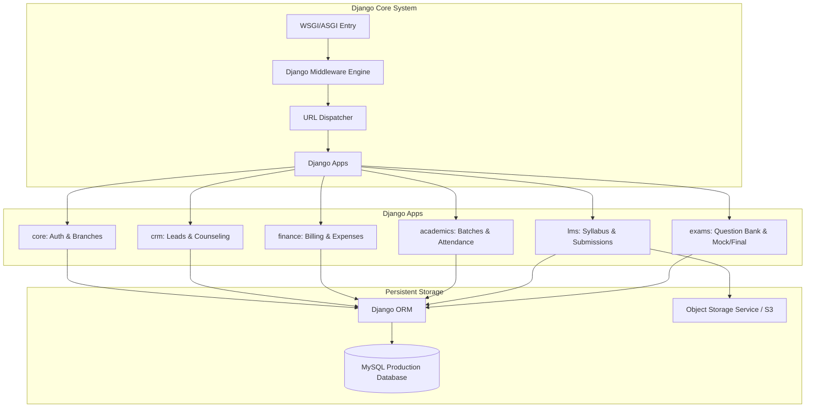

# System Architecture: Flask to Django Transition

This document provides a comprehensive technical audit of the current Flask + SQLite ERP architecture, analyzing its strengths, weaknesses, security gaps, and scalability hurdles, and defines the target Django + MySQL architectural design.

---

## 1. Current Architecture Analysis (Flask + SQLite)

The existing production ERP operates as a modular Flask application. The layout utilizes Blueprints to group code logically by functional domains.

### A. Core Architectural Overview
* **Server Framework**: Flask (using WSGI, serving templates rendered on the server).
* **Database**: SQLite (`instance/database.db`), managed via raw SQL queries executed through a custom connection helper in `db.py`.
* **Templating**: Jinja2 templates, extending a base layout with CSS/JS components.
* **Authentication**: Manual session cookie storage managing `user_id` and student credentials separately.
* **Integrations**: Direct calls to the Gemini API (leads counseling) and Cloud SMS Gateways.

### B. Technical Audit: Strengths & Weaknesses

| Architectural Dimension | Current Flask + SQLite Implementation | Strengths | Weaknesses / Risks |
| :--- | :--- | :--- | :--- |
| **Modular Layout** | Folder hierarchy is split into explicit domain subdirectories (`leads`, `billing`, `attendance`, `lms_admin`, etc.). | Clear separation of static files, templates, and views by domain. | Lack of enforced interface boundaries between domains; files like `billing/routes.py` contain cross-domain dependencies (direct database queries on students/batches). |
| **Database Operations** | Raw SQL queries written inline in blueprints using SQLite connections. | Low abstraction overhead; direct control over SQLite commands. | Heavy technical debt. Extreme N+1 query execution patterns. Risk of SQL injection if variables are improperly concatenated. SQLite lacks database concurrency (write locking). |
| **Data Types** | SQLite stores dates/timestamps as plain `TEXT` strings. | Simple storage; easy serialization. | Dates are parsed using custom string parsing like `strftime` and `substr` in SQL. Prevents index lookup optimization and leads to performance degradation on reports. |
| **Authentication & Auth** | Separate sessions for ERP Staff (`users`) and Student Portal (`students`). Handled using custom decorator guards. | Clean separation of student portal layout and ERP admin interface. | Manual session expiry. Inconsistent validation across routes. No built-in protection against credential brute-forcing in session controllers. |
| **Authorization Boundaries** | Basic roles (`admin`, `staff`, `student`). Branch constraints checked imperatively. | Simple logic for staff branch restriction (`can_view_all_branches`). | Severe security vulnerabilities: lead mutation routes (`/leads/<id>/edit`, `/leads/<id>/delete`) lack ownership verification checks, allowing any staff member to manipulate any lead. |
| **File Storage** | Direct writes to local directories `/static/images/` and `/static/lms/`. | Simple file reading and writing. | Files are served statically without access authorization checks (LMS video assets and student leave documents can be accessed via URL guessing). |

### C. Strengths of the Current System
1. **Strong Domain Modularization**: The division of folders into domain blueprints makes finding functional files straightforward.
2. **Comprehensive Domain Coverage**: Fully maps the business requirements of a technical education institute (CRM, Billing, Academics, LMS, and Exams).
3. **Decoupled Client Assets**: Leverages server-side rendering but keeps front-end libraries isolated in `/static/js/` and `/static/css/`.

### D. Weaknesses & Scalability Bottlenecks
1. **SQLite Concurrent Write Constraints**: Under high loads (simultaneous attendance marking, online exams, and student logins), SQLite's database lock (`database is locked` error) will cause transaction failures.
2. **Text-Based Date Aggregations**: Because dates are stored as text (e.g. `YYYY-MM-DD HH:MM:SS`), monthly revenue aggregates, cohort analytics, and fee ageings require complex string parsing. The database engine cannot build B-Tree ranges on text representations, forcing full-table scans.
3. **Fat View Monoliths**: Files such as `billing/routes.py` and `lms_admin/routes.py` span thousands of lines, handling routing, parameter verification, SQL execution, UI logic, and exception recovery in single code blocks.
4. **Rate Limiting In-Memory Store**: Flask-Limiter uses `memory://` storage. Under multi-worker processes, the rate-limiting counter is isolated per worker, creating vulnerabilities to distributed authentication brute-forcing.

---

## 2. Django Target Architecture Design

Transitioning to Django moves the codebase from an imperative structure to a standardized, configuration-driven model-view-template (MVT) pattern.

### A. Mapping Flask Blueprints to Django Apps
The modular layout will be mapped into clean Django app scopes:

1. **`core` app**:
   * *Scope*: User accounts, custom profiles, branches, company configuration, system activity logs, and SMS client wrappers.
   * *Rationale*: Houses core lookup models and authentication schemas shared across all downstream modules.
2. **`crm` (Leads) app**:
   * *Scope*: Leads, followups, conversion scoring algorithms, and Gemini AI assistant integration services.
   * *Rationale*: CRM logic is isolated to enrollment generation; keep its database structures separate from registered students.
3. **`finance` (Billing) app**:
   * *Scope*: Invoices, line items, installment plans, receipts, bad debt write-offs, expenses, and expense categories.
   * *Rationale*: Groups all financial records under a transaction processing model ensuring balance checking and ledger consistency.
4. **`academics` (Attendance) app**:
   * *Scope*: Batches, student-batch mappings, daily attendance logs, attendance warnings, and student leave requests.
   * *Rationale*: Encompasses the academic scheduling and tracking system.
5. **`lms` app**:
   * *Scope*: Master programs, master chapters, master topics, contents, attachments, assignments, submissions, and progress trackers.
   * *Rationale*: Separates educational program structure and student syllabus progress from core administrative records.
6. **`exams` app**:
   * *Scope*: MCQ question banks, mock attempt logs, exam applications, and final attempts.
   * *Rationale*: Keeps exam rules and grading decoupled from general LMS content views.
7. **`reports` app**:
   * *Scope*: Read-only database views, CSV export engines, import processing, and metrics generation.
   * *Rationale*: Isolates computationally expensive reporting logic from daily transactional operations.

### B. Core Django Architectural Decisions

#### 1. Authentication & Session Strategy
* **Unified Model**: Use Django's built-in `django.contrib.auth` framework. Customize the user structure by extending `AbstractUser` to represent all system users.
* **Separation of Staff and Students**:
  * Staff and administrators will be marked using Django's standard flag `is_staff = True`.
  * Students will be stored in a profile model `Student` linked to a distinct `User` record with `is_staff = False`.
* **Middlewares**: Custom session validation middleware will enforce that deactivated users (`is_active=False`) are instantly logged out across all active sessions.

#### 2. Media & Static File Management
* **Static Assets**: Django's static files system will manage global assets (Bootstrap, Flatpickr, Custom CSS/JS) and copy them during deployment using `collectstatic`.
* **Media Assets**:
  * Public assets (like company branding logos and student ID signatures) will use the default file system storage backends.
  * Confidential documents (LMS lecture slides, PDF resources, and leave proof uploads) will be managed using a custom storage engine (e.g. `storages.backends.s3boto3.S3Boto3Storage`) with private access rules, generating short-lived presigned URLs for authorized requests.

#### 3. Shared Services Architecture
* Create a dedicated `services` utility folder in the project to manage cross-cutting features:
  * **SMS Service**: Managed as a thread-safe singleton wrapper invoking the third-party REST API.
  * **Gemini AI Service**: Encapsulated class managing lead analysis prompts and API responses.
  * **Financial Calculator**: Service class processing receipts to ensure correct allocation of installment statuses.
