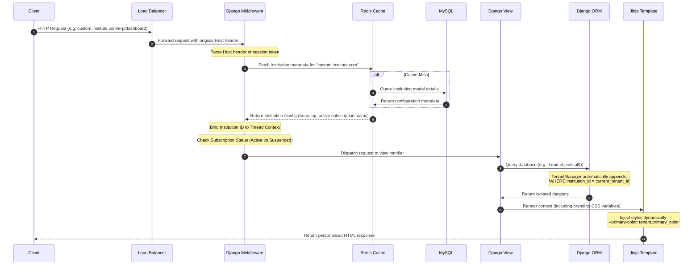

# System Architecture V2: SaaS Multi-Tenant & White-Label Platform

This document describes the high-level architecture of the migrated SaaS Education Management Platform, outlining system components, request flow pipelines, application modularization, and infrastructure topologies that support institutional isolation, white-labeling, and multi-branch operations.

---

## 1. Multi-Tenant Server & Infrastructure Topology

The system uses a **Single Codebase, Single Database, and Single Domain** (supporting subdomains) model. High availability, data isolation, and low latency are achieved using Dockerized container clusters, Redis caching, and managed MySQL replication.

```text
                             Public Internet (HTTPS)
                                        │
                                        ▼
                            [ Cloud Load Balancer ]
                         (SSL/TLS Termination & Routing)
                                        │
                 ┌──────────────────────┴──────────────────────┐
                 ▼                                             ▼
       [ Gunicorn/Django Node 1 ]                    [ Gunicorn/Django Node 2 ]
      (Active Tenant Context Resolving)             (Active Tenant Context Resolving)
                 │                                             │
                 └──────────────┬──────────────┬───────────────┘
                                │              │
        ┌───────────────────────┘              └──────────────────────┐
        ▼                                                             ▼
[ Redis Cache Cluster ]                                     [ Managed MySQL DB (Primary) ]
 - Tenant Settings Caching                                   - Transactional write operations
 - Session store (Redis)                                     - InnoDB Storage Engine
 - Shared rate limiter state                                  │
                                                             ▼
                                                    [ DB Read Replica ]
                                                     - Analytics & reporting
                                                     - Hourly snapshot backups
```

### Core Infrastructure Components
1. **Load Balancer**: Intercepts request headers (such as `Host: institute-a.platform.com`), terminates SSL certificates, and forwards the raw host header to the Django node.
2. **Django Application Cluster**: Runs stateless Docker containers. The Django tenant middleware parses the HTTP host or session cookie, binds the active `Institution` context to the thread-local state, and routes database operations.
3. **Managed MySQL Primary**: A single centralized database instance running InnoDB. All transaction writes are directed here.
4. **Managed MySQL Replica**: A read-only replica that executes high-cost reports (financial collections, counselor conversion metrics) and database snapshots to ensure zero impact on transactional operations.
5. **Redis Cache Store**: Caches resolved tenant configurations (white-label assets, colors, settings) to avoid database lookups on every request, stores sessions, and maintains global rate limits.
6. **Private Object Storage (e.g. AWS S3)**: Hosts sensitive LMS content assets and leave documents under key prefixes structured by tenant: `media/tenant_<institution_id>/lms_private/`. Access is granted only via short-lived pre-signed URLs.

---

## 2. Multi-Tenant Request Lifecycle Pipeline

A visual pipeline representation of how the application resolves tenant scope, filters data records, and dynamically renders branded stylesheets:



---

## 3. Modular App Scopes

To isolate operations and guarantee modularity, the Flask blueprints are redesigned into the following Django applications:

```text
apps/
├── tenants/            # SaaS onboarding, Institution settings, and Subscriptions
├── core/               # Unified Auth (AbstractUser), Branch mapping, and Auditing
├── crm/                # Lead tracking, counselor assignments, and AI utilities
├── finance/            # Invoices, Receipting engine, Expenses, and Bad Debt
├── academics/          # Batches scheduling, Attendance, and Leave applications
├── lms/                # Master chapter repository and tenant syllabus assignments
├── exams/              # MCQ question bank and mock/final testing models
└── reports/            # Background export workers (Celery) and analytics builders
```

### App Scope Mappings
* **`tenants`**: Houses `Institution` and `Subscription` models. Intercepts incoming requests to resolve tenant scope.
* **`core`**: Extends Django's `AbstractUser` to map custom roles (Platform Owner, Institution Admin, Trainer, Student, etc.) and binds users to their parent `Institution`.
* **`crm`**: Houses prospect metrics, follow-up history, and Gemini AI counseling integrations, scoped strictly to the active `Institution`.
* **`finance`**: Operates the collections system, billing ledger, installment plans, receipts allocation, and expense logs.
* **`academics`**: Configures batch cohorts, batch conflicts, attendance records, leave approvals, and consecutive absence alerts.
* **`lms`**: Serves learning materials. Supports mapping a master program schema to specific tenant instances with custom visual visibility settings.
* **`exams`**: Manages mock tests and proctored final exam configurations.
* **`reports`**: Processes bulk CSV/JSON files and triggers data backup exports using a background task queue (Celery + Redis).

---

## 4. Key Architectural Changes for Multi-Tenancy

### A. Dynamic Host Routing & Tenant Middleware
The middleware intercepts every request:
1. Resolves the subdomain or custom domain.
2. Identifies the active `Institution` ID and binds it to a thread-local/context variable.
3. Checks subscription status: if an institution's subscription is unpaid and past grace limits, redirects all traffic to `/tenants/suspended/`.

### B. Implicit Row-Level Database Filtering
All tenant-scoped models inherit from a base `TenantModel` that defines:
* A ForeignKey to `Institution`.
* A custom Django Manager (`TenantManager`) that overrides the default `get_queryset()` method to automatically filter results by the active thread-local `institution_id`.
* A validation check in the model's `save()` method to prevent writing data with mismatched tenant scopes.

### C. Dynamic White-Labeling Config
Branding attributes are loaded into the request context via context processors:
* Core stylesheet colors (primary, secondary, text) are injected as CSS variables directly in `base.html` variables.
* Invoice templates read the custom prefix, logo path, and local bank instructions dynamic fields.
