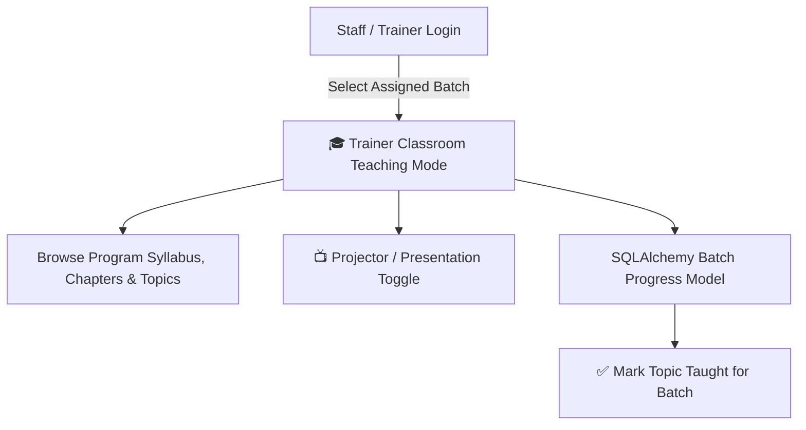

# Implementation Plan: Trainer Classroom Teaching Mode (SQLAlchemy Enabled)

## Objective & Scope

Build a dedicated **Trainer Classroom Teaching Mode** accessible directly from Staff & Admin logins. This enables staff and trainers to project and deliver LMS lessons (chapters, master topics, video tutorials, PDF slide notes, code samples, and exercises) directly to their assigned batches without needing a demo student account or credential switching.

---

## Technical Architecture & SQLAlchemy Models



### 1. Database Model (`lms_batch_topic_progress`)
We will create a new SQLAlchemy model `LMSBatchTopicProgress` (and corresponding database table creation in `db.py` / SQLAlchemy migration) to track when a trainer covers a topic in class for a specific batch:

```python
class LMSBatchTopicProgress(Base):
    __tablename__ = 'lms_batch_topic_progress'
    
    id: Mapped[int] = mapped_column(Integer, primary_key=True, autoincrement=True)
    batch_id: Mapped[int] = mapped_column(Integer, nullable=False, index=True)
    program_id: Mapped[int] = mapped_column(Integer, nullable=False, index=True)
    master_topic_id: Mapped[int] = mapped_column(Integer, nullable=True)
    topic_id: Mapped[int] = mapped_column(Integer, nullable=True)
    taught_by_user_id: Mapped[int] = mapped_column(Integer, nullable=False)
    taught_at: Mapped[datetime] = mapped_column(DateTime, default=datetime.utcnow)
    notes: Mapped[str] = mapped_column(Text, nullable=True)
    created_at: Mapped[datetime] = mapped_column(DateTime, default=datetime.utcnow)
```

---

## User Experience & Key Features

### 🎓 Classroom Teaching Interface (`/lms_admin/batch/<int:batch_id>/teach`)
1. **Batch & Program Selection**:
   - Automatically loads the batch info, trainer details, and linked LMS program(s).
2. **Interactive Syllabus Sidebar**:
   - Hierarchical list of chapters and master topics.
   - Shows real-time badge indicator: **"Taught in Class"** vs **"Pending"**.
3. **Classroom Content Canvas**:
   - Embedded video player for lesson tutorials.
   - PDF slide reader & document viewer for lecture notes.
   - Rich HTML notes, code snippets, and exercise questions.
4. **📺 Projector / Presentation Mode Toggle**:
   - Single-click button that maximizes the content area, hiding top navbar and admin sidebars for clean projection on classroom projectors/monitors.
5. **✅ Mark Topic Taught for Batch**:
   - Trainer can click **"Mark Taught in Class"** to record topic completion for the batch in `lms_batch_topic_progress`.

---

## Proposed Changes

### Component 1: Database & Models

#### [NEW] [modules/lms_admin/models.py](file:///c:/Users/hello/attnandbilling/modules/lms_admin/models.py)
- Define `LMSBatchTopicProgress` SQLAlchemy Declarative Model.

#### [MODIFY] [db.py](file:///c:/Users/hello/attnandbilling/db.py)
- Add `CREATE TABLE IF NOT EXISTS lms_batch_topic_progress` for DB initialization compatibility.

---

### Component 2: Backend Routes (SQLAlchemy Enabled)

#### [MODIFY] [modules/lms_admin/routes.py](file:///c:/Users/hello/attnandbilling/modules/lms_admin/routes.py)
- Add `GET /lms_admin/batch/<int:batch_id>/teach`:
  - Validates trainer/admin access to batch.
  - Queries batch programs, chapters, topics, video/PDF assets, and batch taught status via SQLAlchemy / database helpers.
- Add `POST /lms_admin/batch/<int:batch_id>/mark-topic-taught`:
  - Inserts/deletes records in `lms_batch_topic_progress` via SQLAlchemy session.

---

### Component 3: Frontend Templates & Action Links

#### [NEW] [templates/lms_admin/classroom_teach_mode.html](file:///c:/Users/hello/attnandbilling/templates/lms_admin/classroom_teach_mode.html)
- Modern presenter view template featuring:
  - Collapsible Chapter/Topic Tree
  - Content Presentation Stage
  - Projector Mode Toggle
  - "Mark Topic Taught for Batch" Action Button

#### [MODIFY] [templates/billing/batches.html](file:///c:/Users/hello/attnandbilling/templates/billing/batches.html) & [templates/billing/student_batch_progress_monitor.html](file:///c:/Users/hello/attnandbilling/templates/billing/student_batch_progress_monitor.html)
- Add **"🎓 Teach Batch"** button on batch cards and headers.

---

## Verification Plan

### Automated Verification
- Execute route tests for `/lms_admin/batch/<batch_id>/teach` and `/lms_admin/batch/<batch_id>/mark-topic-taught`.
- Test SQLAlchemy model creation and query execution.

### Manual Verification
1. Log in as a Trainer / Admin.
2. Go to **Manage Batches** or **Batch Progress Monitor** and click **"Teach Batch"**.
3. Navigate chapters and topics, test video/PDF content rendering.
4. Click **Projector Mode** to verify full-screen distraction-free layout.
5. Click **Mark Taught in Class** and verify the status updates in the database.
